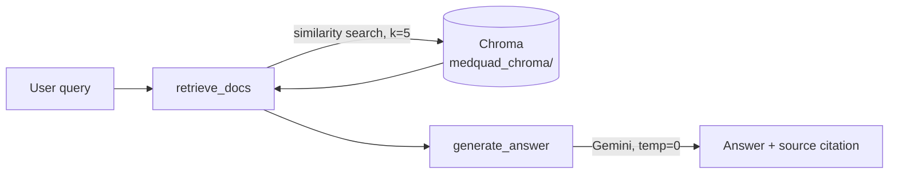

# rag-medical-guidelines

A Retrieval-Augmented Generation (RAG) agent that answers medical questions **strictly** from a
grounded knowledge base — never from the model's own training data. Built on
[Google ADK](https://google.github.io/adk-docs/) 2.0's graph-based `Workflow` API, it retrieves
relevant passages from a [MedQuAD](https://github.com/abachaa/MedQuAD)-derived Chroma vector store
and answers using Gemini, citing its source. If nothing relevant is found, it says so explicitly
instead of guessing.

## Table of contents

- [How it works](#how-it-works)
- [Requirements](#requirements)
- [Quickstart](#quickstart)
- [Usage](#usage)
- [Configuration](#configuration)
- [Evaluation](#evaluation)
- [Testing](#testing)
- [Project structure](#project-structure)
- [Deployment](#deployment)
- [Data & attribution](#data--attribution)

## How it works

The agent (`app/agent.py`) is a two-node ADK `Workflow`:



1. **`retrieve_docs`** — embeds the query with OpenAI's `text-embedding-3-small` and runs a
   similarity search (`k=5`) against the Chroma index in `medquad_chroma/` (see
   [Quickstart](#quickstart) to build it).
2. **`generate_answer`** — sends the retrieved passages and the query to `gemini-flash-latest`
   (temperature `0`) with a strict system prompt: answer only from the provided context, cite the
   source folder (e.g. `3_GHR_QA`), or reply exactly `there is no source.` if the context doesn't
   answer the question.

`app/fast_api_app.py` wraps this workflow in a FastAPI app that exposes ADK's standard web UI/API
routes, an A2A (Agent2Agent) JSON-RPC endpoint, and a `/feedback` endpoint for logging user ratings.

## Requirements

- Python >= 3.10 (developed against 3.12)
- [`uv`](https://docs.astral.sh/uv/)
- An `OPENAI_API_KEY` (embeddings) and either a `GEMINI_API_KEY` or Vertex AI access (generation)

## Quickstart

```bash
# 1. Install dependencies
uv sync

# 2. Configure credentials
cp .env.example .env
# edit .env — see Configuration below

# 3. Build the vector index (one-time; downloads MedQuAD and calls the OpenAI embeddings API)
uv run python scripts/build_vector_db.py

# 4. Run the server
uv run uvicorn app.fast_api_app:app --reload --port 8000
```

The vector index (`medquad_chroma/`) is **not** checked into the repo — it's ~300MB of generated
data, well over what's practical to version — so step 3 is required before the agent can answer
anything. `scripts/build_vector_db.py` clones [MedQuAD](https://github.com/abachaa/MedQuAD) into
`MedQuAD/`, parses every Q&A pair out of its XML files, embeds each pair with
`text-embedding-3-small`, and persists the result to `medquad_chroma/`. It's a one-time step (the
script skips rebuilding if `medquad_chroma/` already exists — pass `--rebuild` to force
regeneration).

For interactive local testing instead of raw HTTP calls, use the
[`agents-cli`](https://google.github.io/agents-cli/):

```bash
uv tool install google-agents-cli
agents-cli playground
```

## Usage

Once the server is running on `:8000`, the ADK web UI is available at `http://localhost:8000`.
To call the agent programmatically over A2A:

```bash
curl -X POST http://localhost:8000/a2a/app \
  -H "Content-Type: application/json" \
  -d '{
    "jsonrpc": "2.0",
    "id": "1",
    "method": "message/send",
    "params": {
      "message": {
        "role": "user",
        "parts": [{"kind": "text", "text": "What are the symptoms of diabetes?"}],
        "messageId": "msg-1"
      }
    }
  }'
```

Submit user feedback on a response:

```bash
curl -X POST http://localhost:8000/feedback \
  -H "Content-Type: application/json" \
  -d '{"score": 5, "text": "Accurate and well cited"}'
```

## Configuration

All configuration is via environment variables (see `.env.example`).

| Variable | Required | Description |
|---|---|---|
| `OPENAI_API_KEY` | Yes | Used for query/document embeddings (`text-embedding-3-small`). |
| `GOOGLE_GENAI_USE_VERTEXAI` | One of these two paths | `true` to generate via Vertex AI. |
| `GOOGLE_CLOUD_PROJECT`, `GOOGLE_CLOUD_LOCATION` | With Vertex AI | GCP project and location (use `global`, not a regional location — see note below). |
| `GEMINI_API_KEY` | Alternative to Vertex AI | Generate via the Gemini API (Google AI Studio) instead. |
| `ALLOW_ORIGINS` | No | Comma-separated CORS origins for the FastAPI app. |
| `LOGS_BUCKET_NAME` | No | GCS bucket for artifacts and, if set, OpenTelemetry GenAI trace upload. |

> **Note:** if you see a 404 on the generation model, check `GOOGLE_CLOUD_LOCATION` — it should be
> `global`, not a specific region.

## Evaluation

Eval cases live in `tests/eval/datasets/basic-dataset.json` (schema documented in
`tests/eval/datasets/README.md`) and are graded by an LLM-as-judge
(`tests/eval/response_quality.py`, wired up in `tests/eval/eval_config.yaml`) on a 1–5 scale for
accuracy, relevance, and clarity.

Via `agents-cli`:

```bash
agents-cli eval generate
agents-cli eval grade
```

Or standalone, without the CLI:

```bash
uv run python run_local_eval.py
```

## Testing

```bash
uv run pytest tests/unit tests/integration
```

| Path | Purpose |
|---|---|
| `tests/unit/` | Business-logic unit tests. |
| `tests/integration/test_agent.py` | Smoke-tests the agent's streaming response end to end. |
| `tests/integration/test_server_e2e.py` | End-to-end test against the running FastAPI server. |

## Project structure

```
app/
├── agent.py              # ADK Workflow: retrieve_docs -> generate_answer
├── fast_api_app.py        # FastAPI app: ADK routes + A2A + /feedback
└── app_utils/
    ├── services.py         # Shared session/artifact services (in-memory locally, GCS/Vertex when deployed)
    ├── telemetry.py         # OpenTelemetry -> Cloud Trace/Logging setup
    ├── a2a.py                # Agent2Agent (A2A) route registration
    └── typing.py              # Feedback pydantic model
scripts/
└── build_vector_db.py     # Builds medquad_chroma/ from MedQuAD (run before first use)
medquad_chroma/           # Chroma vector index (generated, gitignored — see Quickstart)
MedQuAD/                  # Source dataset (cloned by the build script; not needed at runtime, gitignored)
langchain-rag.ipynb       # Original prototyping notebook; superseded by scripts/build_vector_db.py
tests/
├── unit/, integration/    # pytest suites
└── eval/                   # eval dataset + LLM-as-judge config
run_local_eval.py         # Standalone eval runner (no agents-cli required)
Dockerfile                # Container image: uvicorn app.fast_api_app:app
```

## Deployment

`Dockerfile` builds an image that runs `uvicorn app.fast_api_app:app` on port `8080`. It bundles
whatever is in `medquad_chroma/` at build time, so **run the build script before building the
image**:

```bash
uv run python scripts/build_vector_db.py   # only if medquad_chroma/ doesn't exist yet
docker build -t rag-medical-guidelines .
docker run -p 8080:8080 --env-file .env rag-medical-guidelines
```

No deployment target is configured yet (`deployment_target: none` in
`agents-cli-manifest.yaml`). To provision infrastructure and deploy, use:

```bash
agents-cli infra single-project
agents-cli deploy
```

## Data & attribution

Answers are grounded in [MedQuAD](https://github.com/abachaa/MedQuAD), a collection of ~47,000
medical question–answer pairs from 12 NIH websites, licensed under
[CC BY 4.0](https://creativecommons.org/licenses/by/4.0/). If you redistribute this project's
outputs, retain attribution to MedQuAD and its authors:

> Ben Abacha, A., Demner-Fushman, D. A Question-Entailment Approach to Question Answering. BMC
> Bioinformatics, 2019.

This project itself does not answer general medical questions from model knowledge — only from
retrieved MedQuAD content — and is not a substitute for professional medical advice.
